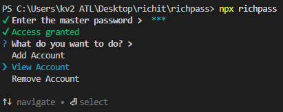

# Richpass
A cli based password manager made by richit.<br> For hackvault

## Features
- Free to use
- Just for the devs
- No mouse required
- Can be used with just a keybaord
- Encrypts passwords with a master key
- The master key is encryoted as well
- No openly stored keys or passwords
- Runs locally, No server required.
- Add accounts
- Delete accounts
- Select and list their passwords

## Images

<!-- <div style="left: 0; width: 100%; height: 0; position: relative; padding-bottom: 56.25%;"><iframe src="https://hc-cdn.hel1.your-objectstorage.com/s/v3/a1d1899e6477fa63_ghast_v6xcxuczwd.mp4" style="top: 0; left: 0; width: 100%; height: 100%; position: absolute; border: 0;" allowfullscreen scrolling="no" allow="encrypted-media *;"></iframe></div> -->

## Installation 
Download using 
```
npm i -g richpass
```
You must have npm installed.
As well as nodejs.
## Usage 
### Windows
```
npx richpass
```
### MacOS
```
richpass
```
### Linux 
```
richpass
```

## What's next?
I am planing to add:
- Option to chnage master password: Will remove all accounts and passwords
If you want to do this before i make it. You must uninstall your package and reinstall it.
- A new cool login screen

